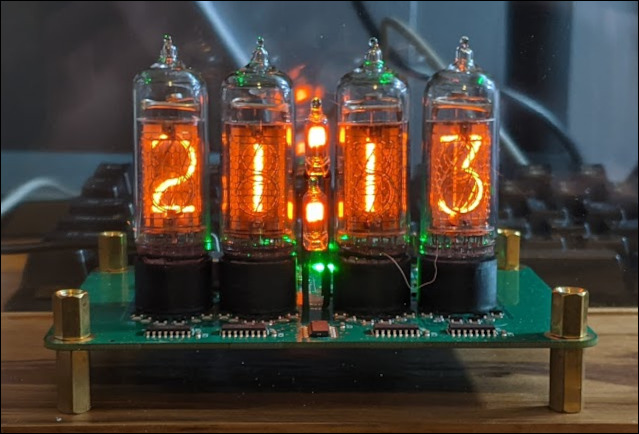

# KiCAD STM32F0 Nixie Tube Clock

This repository contains the design files and assembly files for my nixie tube
clock design. The code (firmware) can be located at
<https://github.com/bdebyl/stm32-nixieclock>

The assembly files and docs are kept up to date to the best of my abilities.

